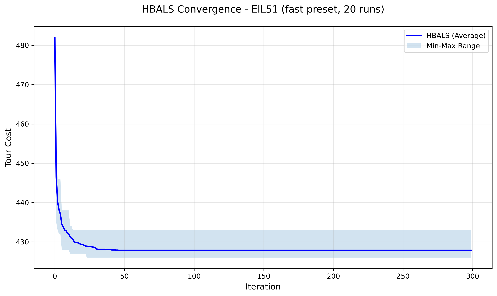

# HBALS: Hybrid Bees Algorithm with Adaptive Local Search for the TSP

A hybrid metaheuristic combining the **Bees Algorithm (BA)** with **adaptive 2-opt / 3-opt local search** to solve the Traveling Salesman Problem (TSP). Benchmarked against BA, ACO, GA, and PSO on six TSPLIB instances.

> Originally developed as a final project for the "Computer Project" course at Islamic Azad University, Ardabil (2026). This repo contains the cleaned-up implementation, full experimental results, and the original paper.

## Why

TSP is NP-Hard, so exact methods don't scale. Metaheuristics like the Bees Algorithm trade optimality guarantees for tractable runtime — but the standard BA converges slowly and stagnates in local optima. HBALS addresses this by applying local search (2-opt/3-opt) **adaptively**, only on the most promising regions, to speed up convergence without sacrificing population diversity.

## Results

Tested on TSPLIB instances (20 independent runs, 300 iterations each, `fast` preset):

| Dataset | n | Best | Mean | Std | Time (s) |
|---|---|---|---|---|---|
| eil51 | 51 | 426 | 427.85 | 1.68 | 4.62 |
| berlin52 | 52 | 7542 | 7543.0 | 2.00 | 5.31 |
| st70 | 70 | 675 | 679.4 | 2.82 | 11.91 |
| kroA100 | 100 | 21296 | 21388.6 | 79.06 | 39.17 |
| ch150 | 150 | 6570 | 6627.95 | 40.13 | 83.68 |
| rat195 | 195 | 2349 | 2375.3 | 14.16 | 161.51 |

### vs. BA, ACO, GA, PSO

HBALS produced the best solution quality on **every single dataset** tested:

| Dataset | Algorithm | Best | Mean | Std | Time (s) |
|---|---|---|---|---|---|
| eil51 | **HBALS** | **426** | **427.85** | 1.68 | 4.62 |
| eil51 | BA | 482 | 482.0 | 0.0 | 0.72 |
| eil51 | ACO | 438 | 452.75 | 6.27 | 20.66 |
| eil51 | PSO | 489 | 505.65 | 3.96 | 0.29 |
| eil51 | GA | 674 | 770.65 | 45.8 | 0.34 |
| kroA100 | **HBALS** | **21296** | **21388.6** | 79.05 | 39.17 |
| kroA100 | ACO | 23240 | 23611.4 | 230.5 | 123.28 |
| kroA100 | PSO | 25816 | 26117.15 | 69.08 | 0.5 |
| kroA100 | BA | 26133 | 26133 | 0.0 | 0.83 |
| kroA100 | GA | 71781 | 79111.4 | 3629.83 | 0.67 |

*(Full comparison table for all 6 datasets in [`results/csv/`](results/csv/).)*

**Takeaways:**
- HBALS beats BA, ACO, GA, and PSO on solution quality across all tested instances.
- ACO gets closest to HBALS in quality but is 3-30x slower.
- BA has zero variance (std=0) because it repeatedly converges to the *same* mediocre solution — not a sign of quality, just stagnation.
- Time complexity: `O(T(n + m(nep+nsp)))` for HBALS vs `O(T·n²)` for ACO — HBALS is faster than ACO but slower than plain BA/PSO, which is the expected cost of the added local search.

### Convergence

HBALS reaches near-optimal values within the first 50-80 iterations on every tested instance (see [`results/plots/`](results/plots/)):



## Algorithm

1. **Initialize population** — mix of Nearest-Neighbor-constructed tours and random tours (`nn_ratio` controls the split), balancing initial quality and diversity.
2. **Evaluate & sort** — rank the population by tour length.
3. **Elite site search** — apply intensive 2-opt (and occasional 3-opt) local search around the top `e` elite tours.
4. **Selected site search** — apply lighter local search around the next `m` best tours.
5. **Scout bees** — fill the rest of the population with fresh random tours to preserve exploration.
6. **Adaptive neighborhood** — the search radius shrinks (`alpha`) after improvements and grows (`beta`) after stagnation.
7. **Repeat** until max iterations or `no_improve_threshold` consecutive non-improving generations.

## Usage

```bash
pip install -r requirements.txt

# Run HBALS
python src/hbals.py --tsp-file data/eil51.tsp --preset fast --runs 20 --max-iter 300

# Run any baseline the same way
python src/baselines/ba.py  --tsp-file data/eil51.tsp --runs 20 --max-iter 300
python src/baselines/aco.py --tsp-file data/eil51.tsp --runs 20 --max-iter 300
python src/baselines/ga.py  --tsp-file data/eil51.tsp --runs 20 --max-iter 300
python src/baselines/pso.py --tsp-file data/eil51.tsp --runs 20 --max-iter 300
```

All six TSPLIB instances used in the experiments are included in [`data/`](data/), so results are reproducible out of the box — no external downloads needed.

## Repo structure

```
HBALS-TSP/
├── src/
│   ├── hbals.py               # HBALS implementation (population, local search, solver, CLI)
│   └── baselines/
│       ├── ba.py               # Basic Bee Algorithm (no local search — isolates HBALS's contribution)
│       ├── aco.py              # Ant Colony Optimization (Ant System)
│       ├── ga.py                # Genetic Algorithm (OX crossover, swap mutation)
│       └── pso.py               # Particle Swarm Optimization (adapted for permutation space)
├── data/                        # TSPLIB instances (eil51, berlin52, st70, kroA100, ch150, rat195)
├── results/
│   ├── csv/                     # HBALS per-instance result summaries
│   ├── plots/                   # HBALS convergence curves
│   └── baselines/
│       ├── csv/                 # BA / ACO / GA / PSO result summaries
│       └── plots/                # BA / ACO / GA / PSO convergence curves
├── docs/
│   └── HBALS_paper.docx        # Original write-up (algorithm derivation, related work, discussion)
└── requirements.txt
```

## Limitations & future work

- The "3-opt" operator is a lightweight randomized segment-reversal search, not a full 3-opt neighborhood (which considers all 7 reconnection types) — noted for transparency, not hidden.
- Performance is sensitive to parameter tuning (`n`, `m`, `e`, `nep`, `nsp`, `ngh`); no automated tuning was performed.
- Tested up to 195 cities; scaling behavior on larger instances (500+) is untested.
- Possible extensions: parallel/GPU local search, adaptive parameter self-tuning, hybridization with Lin-Kernighan moves.

## Author

Erfan Khadiv — Computer Engineering, Islamic Azad University, Ardabil

Supervisor: Dr. Masoud Bakravi
 
## License

MIT — see [LICENSE](LICENSE).

